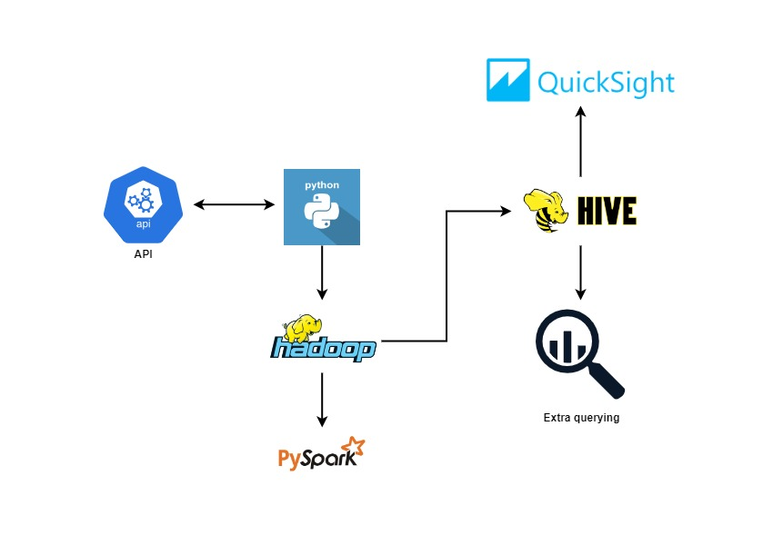

# Cryptocurrency-Data-Mining-Pipeline
In this project, I practiced my data engineering and analytics skills by successfully developing an ETL pipeline that extracts and parses Cryptocurrency data from an API and saves it to an EC2 instance. Then it reads and transforms the data using PySpark and visualizes the data using AWS Quicksight for data analysis.

## How I completed this project:
To build this project, first I extracted data from an API using Python, parsed it, uploaded the data onto HDFS, then I saved it to an AWS EC2 instance. I used the Kyro serialization and Spark optimization techniques. I also created an external table on HIVE. Last but not least, I loaded the data and visualized the data using AWS Quicksight.

## Pipeline Architecture

## AWS QuickSight Dashboard:

## About the Dataset:
The API that I used for this project is from [coinlore.com](https://www.coinlore.com/). It's a website that provides the latest information on cryptocurrency prices. Here are some of the columns from the data that I took from this source:

* **Symbol:** The Cryptocurrency's symbol
* **Name:** The Cryptocurrency's name
* **nameid:** The ID of a particular coin
* **Rank:** The rank of the Cryptocurrency
* **price_usd:** The price of Cryptocurrency in US dollars
* **percent_change_24h:** The change of the Cryptocurrency's price in the last 24 hours
* **percent_change_1h:** The change of the Cryptocurrency's price in the last 1 hour
* **percent_change_7d:** The change of the Cryptocurrency's price in the last 7 days
* **price_btc:** The Cryptocurrency's price
* **market_cap_usd:** The Cryptocurrency's share of the market in US dollars

## What I learned from this project:
I learned quite a lot from working on this project. Some takeaways are (but are not limited to):
* A better understanding of what a data warehouse is
* Building data warehouses using HIVE and Spark
* Installing Hadoop, Spark, and HIVE on AWS EC2
* Visualizing data with AWS Quicksight
* Extracting data from APIs using Python
* Uploading data from an EC2 instance to HDFS
* Performing the PySpark Analysis and Kryo Serialization
* Creating tables and databases for HIVE in an AWS EC2 instance
